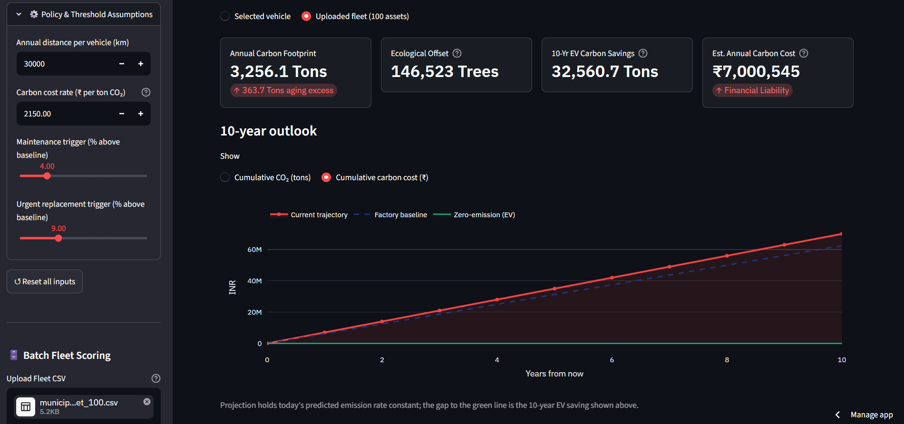
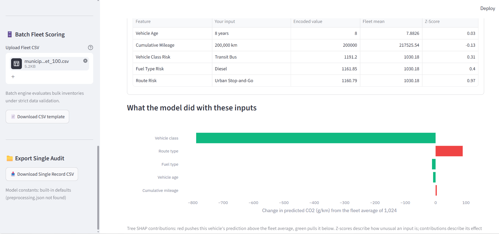
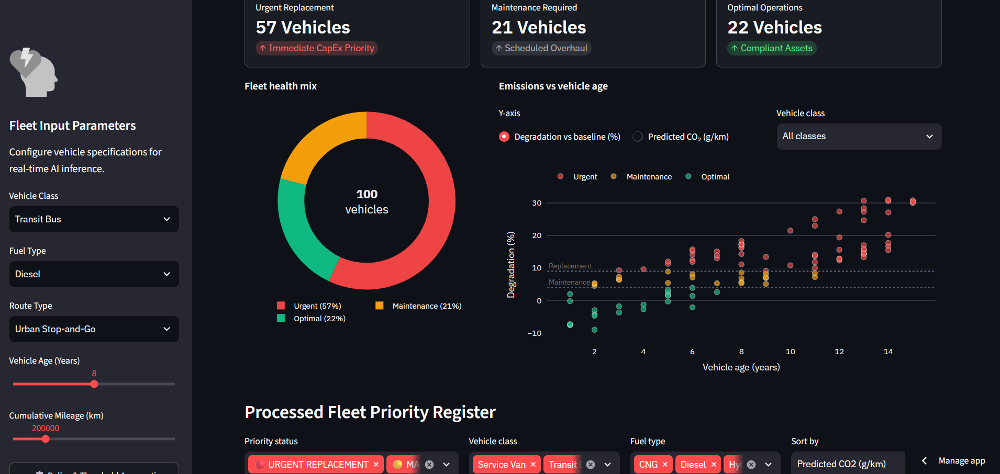
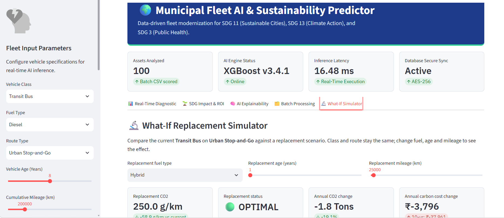

# 🌍 Municipal Fleet AI & Sustainability Predictor

A Streamlit dashboard that predicts CO₂ emissions (g/km) for municipal vehicles, flags degraded assets for maintenance or replacement, and translates the results into carbon cost and SDG impact. Built as an M.Sc. Data Science & Applied Statistics portfolio project.

## 🖥️ Dashboard Previews

### 1. Real-Time Diagnostic & Action Protocol


### 2. Financial ROI & SDG Impact


### 3. AI Explainability (Tree SHAP Contributions)


### 4. Bulk Fleet Scoring & Health Distribution


### 5. What-If Modernization Simulator


*Data note: the model is trained on a synthetic fleet dataset. Reported scores show how well the model recovers the generating rules, not accuracy on a real fleet.*

## Features
* **Single-vehicle inference:** Enter vehicle class, fuel type, route type, age and mileage to get a predicted CO₂ value, a gauge against the factory baseline, and a recommended action.
* **Batch scoring:** Upload a fleet CSV to score every vehicle at once, with filters, sorting and CSV export. Uploads are validated for missing columns, unrecognised categories, blank or negative values, and vehicles outside the training range.
* **Financial and SDG impact:** Annual footprint, tree-offset equivalent, 10-year EV savings and carbon cost, linked to SDG 11, SDG 13, and SDG 3.
* **Explainability:** Feature Z-scores, Tree SHAP contributions, sensitivity curves and feature importance.
* **What-if simulator:** Compare the current vehicle with a replacement scenario or another fuel type.
* **Adjustable assumptions:** Annual distance, carbon price and status thresholds are set in the sidebar.

## How Status is Decided
Predicted emissions are compared with a per-class factory baseline. Thresholds are adjustable; defaults shown below:

| Status | Default rule |
| :--- | :--- |
| **Optimal** | Below baseline + 4% |
| **Maintenance required** | Baseline + 4% or higher |
| **Urgent replacement** | Baseline + 9% or higher |

*Baselines (g/km): Service Van 220, Transit Bus 1,100, Waste Truck 1,300.*
*The default carbon price is ₹2,150 per ton CO₂. It is an assumption you can change in the sidebar, not an official rate.*

## Model and Data
* **Model:** XGBoost regressor
* **Features:** Vehicle class, fuel type, route type, age, cumulative mileage
* **Preprocessing:** Target encoding of categoricals, then Z-score standardisation, fitted on the training split only
* **Data:** 5,000 synthetic vehicles, ages 1–15 years, 15,000–40,000 km per year
* **Validation:** Repeated 5-fold cross-validation (3 repeats), preprocessing refitted in every fold

## Development with IBM Bob
The synthetic fleet dataset, the preprocessing pipeline and the model-training scripts were developed with **IBM Bob**, IBM's AI development partner. Requirements were written as natural-language prompts; the generated code was then reviewed, run and refined by the author. Later refinement of the pipeline, dashboard and documentation used a general-purpose AI assistant.

| Stage | Objective | Tool |
| :--- | :--- | :--- |
| Data generation | Realistic synthetic fleet dataset (5,000 vehicles, fixed seed) | IBM Bob |
| Preprocessing | Target encoding, standardisation, cleaned dataset | IBM Bob |
| Model training | XGBoost with train/validation/test split, early stopping, repeated CV | IBM Bob |
| Dashboard | Streamlit app with batch, ROI, explainability and what-if views | IBM Bob, later refined with a general-purpose AI assistant |

## Project Structure
```text
.
├── app.py                    # Streamlit dashboard
├── docs/                     # Dashboard screenshots
├── xgb_model.json            # Trained model
├── preprocessing.json        # Encodings, scaler values and training ranges
├── model_metadata.json       # Metrics, parameters and versions
├── municipal_fleet_100.csv   # Sample fleet for batch scoring
├── requirements.txt          # Dependencies
├── fleet_pipeline.py         # Data generation, preprocessing, training and export
├── data_prep.py              # Data preparation script (IBM Bob)
├── train_model.py            # Model training script (IBM Bob)
└── raw_fleet_data.xls        # Raw dataset
```

## Quick Start
```bash
git clone https://github.com/rohit-shukla09/municipal-fleet-emissions-ai.git
cd municipal-fleet-emissions-ai
pip install -r requirements.txt
streamlit run app.py
```
Upload `municipal_fleet_100.csv` from the sidebar to try batch scoring.

## Tech Stack
Streamlit, Plotly, XGBoost, scikit-learn, pandas, NumPy.

## Author
**Rohit Shukla** · M.Sc. Data Science & Applied Statistics
